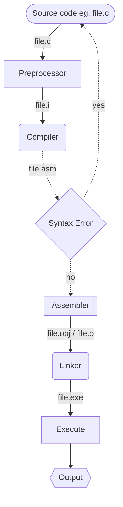
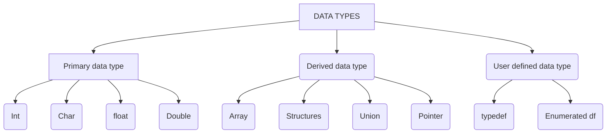
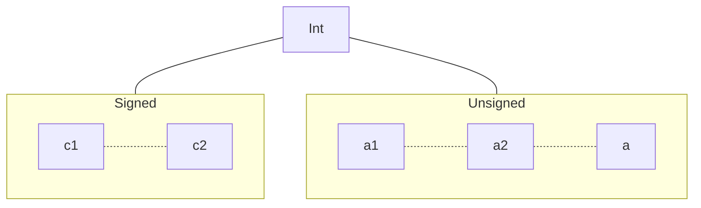

# C documentations

## TABLE OF CONTENT

- [History of computing](#history-of-computing)
- [Things to know about c](#things-to-know-about-c)
- [Why learn c](#why-learn-c)

## HISTORY OF COMPUTING  

- The field of computing started in the year **1947** where three scientist (**William Shockley, Walter Brattain, and John Bardeen**) at **bell labs** invented the **transistor**  
- After then in **1956** the **first fully transistor based computer** was developed at **MIT** the ***TX-0***
- Afterthen the **first integerated circuit** was created in ***1958*** by **Jack kilbly** at **Texas instrument** .
- But before then is the existence of the first high level language which was the **fotran projec**t which was originally developed in year **1954** by IBM a shortening of ”**The IBM Mathematical Formula Translating System**”
-The Algorithmic Language **(Algol 58)** was derived from Fortran in **1958**and evolved into **Algol 60** in **1960**.
- Then the **PL-1**.
- Then the **Combined Programming Language (CPL)** was then created out of **Algol 60** in ***1963***
- In ***1967*** it evolved into **BASIC CPL (BCPL)** which was itself for the base of **B** in **1969** which was developed by **MARTINS RICHARD** of cambridge
- Finally **B** the root of **C** was created in the year in **1971** which was a break down of **BCPL** and also a compiled language created by **ken Thompson** of Bell Labs
- The **B compiler** on **PDP-7** did not generate machine codes instead it **threaded** code **(An imperative scheme in which the compiler output consists of a sequene of addresses of code fragement that performs elementary operations.This operation was typically in particular for B)**
- **Thompson and Dennis** improved and called it **NB**, This created its logical successor **C**
- Most of the **Unix** was rewritten in **NB** and then written in **c**
- The portability of **Unix** was the main reason for the initial popularity of **unix** and **c**
- The **C language** was developed by **DENNIS RITCHIE** of the **AT&T** **Bell labs** in the year **1972**
- The development of "**C**" was influenced by **MULTICS** (an early timesharing system) and the need for a high-level language for operating system development
- The **ANSI** began work on standerdizing the the C language in **1983** and completed the standard in **1989** **(ANSI X3. 159-1989 Programming Language C)**
- This served as the basic implementation of the **c** compilers
- The standard were later updated in **1990** and **1999** allowing the features that were either in common use or were appearing in **c++**

## THINGS TO KNOW ABOUT C

- The c programming language was developed by Dennis Ritchie in the year 1972 in AT&T Bell labs , New jersey, USA
- C is successor of the b programming language which was developed by Ken Thompson
- C is the language of the linux operating system , Oracle , Android and even web browsers
- C was standerdised by ANSI in 1989
- C is an imperative language
- C is a middle to high level programming language
- C is a small language having only 32 keywords z
- C is a core language ie so many other language depends on it
- C has built in functions and operations
                    Why use C
- It enable the effecient allocation of memory therefore allowing the programmer to write directly into the memory of the computer
- The Foundation of many high level languages: : C programming is essential because many popular languages, including Python, Ruby, Java, and JavaScript, are built on top of the C language.
- Used in Embedded systems : C is the language of choice for embedded systems in critical applications like the Mars Curiosity Rover due to its efficiency and ability to handle resource constraints.
- Development of Operating systems : C is the preferred language for kernel development, which is vital for managing hardware and low-level system functions in operating systems.

## Why Learn C  

1. **Foundation of Many Languages**: C programming is essential because many popular languages, including Python, Ruby, Java, and JavaScript, are built on top of the C language.
2. **Used in Space Missions**: C is the language of choice for embedded systems in critical applications like the Mars Curiosity Rover due to its efficiency and ability to handle resource constraints.
3. **Kernel Development**: C is the preferred language for kernel development, which is vital for managing hardware and low-level system functions in operating systems.
4. **In High Demand**: C programming skills are in high demand in the job market, and it has maintained its relevance over time, making it a valuable skill for programmers.
5. **Teaches Fundamental Computer Concepts**: Learning C provides a deep understanding of computer fundamentals, such as memory management and low-level hardware interactions, which can give programmers a greater appreciation for higher-level languages and their
conveniences.

### Learning Resources

1. ***[Jenny C letures](https://youtube.com/jenny'slectures/cprogramming)***

### Execution of c program

---



This above is a flowhcart of the execution of a c program  

- Firstl, we'll write a source code of a c program eg. file.c  
- The prepocessor translates the prepocessor directives into what the compiler can understand for example the `#include <stdio.h>` the comiler woudnt understand `prinf`, `scanf`  

### C syntax

This is the basic C syntax in [K&R](https://TheCBook.com)

``````c

#include<stdio.h>  //preprocessor directives telling the the preprocessor to add the content of stdio.h for i/o

void my_function(void); //Declaration of function

int main(void) // thus is the main function
{
    printf("I am a C programmer \nAnything else u need to know ");
    return 0;
}

void my_function() //this is a function 2
{

}
``````

### Variables in C

Variables are containers for storing data values i.e they serve as a container to store data in the memory of the computer

- #### Declaring variables

    Declaring a variable is simply just allocating a space in the computer's memory for the value of the variable before assigning a value to the variable. And its done like this `dataType nameOfVariable;`  
    Eg :

    ```c
        int i;  //Declaring a integer variable
        char c; //Declaring a character variable
        double d;   //Declaring a floating point variable
        float f;    //Declaring a floating point variable
        char string[];  //Declaring an array of character variable
    ```

- #### Assigning variables

    This is simple assingning a value to the declared variable and can be done in two ways, either by declaring and assingning the variables at once or declare and assign seperately

    ```c
        int a = 32; //this is simply declaring and assigning a variable
    ```

    ----

    ```c
        int a; // This is declaring a variable
        a = 32; // This is assigning a variable
    ```

### Comments in C

There are two major ways to declare  comments.  
Which are :-

- Single Line comments
  
    ``````c
    //This is a single line comment in c language

    /*This also works for a single line comment*/
    ``````

- Multi-line comments
  
    ```c
        /*
        *This is a multi line comment
        *As we can see it spans multiple lines
        */
    ```

## Keywords and Identifiers

### Keywords

Keywords are reserved words in a pro

## Data Types in c



----

### The **`int`** data type

The `int`data type is used to contain an integer like **1**, **2, 23, 1000** ..... and so on.



----

### Data types table

This is a table that contains the data type, its storage size, Range, and the Format specifier

|Data Types| Storage Size | Range | Format Specifier |
|:---:|:---:|:---:|:---:|
|Int / signed Int||||
|Signed Long Int||||
|Signed Long Long Int||||
|Unsigned Int||||
|Unsigned Long Int||||
|Unsiged Long Long Int||||
|Short Int||||
|Unsigned Short Int||||
|Unsigned char|2 byte| 0 - 36023|%c|
|Signed char|4 byte|||
|Float||||
|Double||||
|Long Double||||
|||||
|||||

Firstly, we declare the variables in the various data types.  
Synopsis **`dataType nameOfTheVariable;`**

``````c
    int i;
    char c;
    double d;
    float f;
    char string[]; /*Thus not an actual data type its just an   array of characters to form a string*/
``````

``````c
    //Printing out data types with  there format specifiers
    printf("This is an integer data type: %d or %i for signed %d for unsigned %u for short %hd", i);
    printf("This is a char data type: %c\n", c);
    printf("This is a double data type: %lf\n", d);
    printf("This is a float data type: %f\n", f);
    printf("This is a character data type in an array to become string: %s\n", string);

    //Sizes of int data types including its size and sign qualifier/Modifier

    printf("The size of int: %lu also the same as the size of signed int: %lu cus by default its signed\n", sizeof(int), sizeof(signed int));
    printf("The size of unsigned int: %lu\n", sizeof(unsigned int));
    printf("The size of long int: %lu\n", sizeof(long int));
    printf("The size of short int: %lu\n", sizeof(short int));
    printf("The size of unsigned long int: %lu\n", sizeof(unsigned long int));
    printf("The size of unsigned short int: %lu\n", sizeof(unsigned short int));
    printf("The size of signed long int: %lu\n", sizeof(signed long int));
    printf("The size of signed short int: %lu\n", sizeof(signed short int));
``````

## Operators in c

 Operators is used to perform operations on variables and values

 ```c
 int a = 2 + 8 ;
 ```

The **+** and **=** there are **operators** the **2** and **8** are **operands**

### Types of operators based on operands

- Unary operator
      - (Unary minus)
      - ++, -- (Increment and decrement)
      -  !! (Logical not operator)
      - & (Address of operator)
      - sizeof operator
- Binary operator
- Ternary operator  
